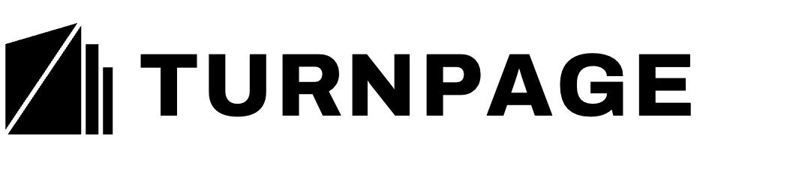

# Daily Briefing — Brand Styling Reference

This file captures every styling decision the daily-briefing system applies. It layers on top of the Turnpage brand guide (palette, typography, voice) with daily-briefing-specific layout, nav, and component patterns.

When generating any new dashboard, advisory approval, posts page, refine page, or background page — apply this spec verbatim. When the user iterates on styling, update this file so future runs absorb the change.

---

## Source of truth

1. **Turnpage brand spine:** `/var/folders/.../skills/turnpage-brand-style/SKILL.md` — palette, typography, voice, hard constraints.
2. **This file:** daily-briefing-specific overlays — layout, nav, components, source-citation pattern.

---

## Palette (daily-briefing variables)

CSS variables. Define in `:root` and override in `[data-theme="dark"]` so all references cascade.

```css
:root {
  --bg: #FFFFFF; --surface: #FFFFFF; --paper-2: #F4F5F7;
  --ink: #0A0A0A; --ink-60: rgba(10,10,10,0.6); --ink-40: rgba(10,10,10,0.4); --ink-20: rgba(10,10,10,0.18);
  --line: rgba(10,10,10,0.08); --line-strong: rgba(10,10,10,0.14);
  --neon: #D4FF00;
}
[data-theme="dark"] {
  --bg: #16161B; --surface: #1F1F25; --paper-2: #1F1F25;
  --ink: #E5E7EB; --ink-60: rgba(229,231,235,0.62); --ink-40: rgba(229,231,235,0.42); --ink-20: rgba(229,231,235,0.18);
  --line: rgba(229,231,235,0.1); --line-strong: rgba(229,231,235,0.18);
}
```

Soft-white text on dark `#16161B` (lift-1) — not pure white on pure black. Lower contrast = easier to read in long-form prose.

### Highlighter (same in both modes)

Neon `#D4FF00` with dark `#0A0A0A` text, at every scale, in both light and dark mode — no muted/olive variant. (A darker `#5D7A00` olive substitute for large highlighter blocks in dark mode existed briefly in Aug 2026 and was reverted: Andrew's explicit call, full neon everywhere, no exceptions.)

```css
:root {
  --neon-block: #D4FF00;
  --neon-on-block: #0A0A0A;
}
[data-theme="dark"] {
  /* no override — inherits the same --neon-block / --neon-on-block as light mode */
}
```

Applies to: `.stat-anchor`, `.anchor-stat`, `.stat-callout`, `.lead-headline .accent`, `h1 .accent`, `.accent`, `.cal-day`, `.card-stat-anchor`, `.stat-anchor-value`, `.tn-pill.active`, source-arrow icons, eyebrow underlines, neon-CTA buttons — all full neon, all the time.

---

## Typography

- Family: **Archivo** only (Google Fonts, weights 400/500/600/700/800/900 + italic 400/800)
- H1: clamp(1.6rem, 2.6vw, 2.2rem), weight 800, letter-spacing −0.02em
- Lead headline (briefing): clamp(1.5rem, 2.8vw, 2.2rem), weight 800
- Body prose: 16px, line-height 1.72
- Eyebrow labels: 0.78rem, weight 700, letter-spacing **0.22em**, uppercase — the brand's signature label move
- Sidebar headings (h2 in `.box`): 0.74rem, weight 700, 0.22em letter-spacing
- Sub-labels (storyline titles, dates row sub): 0.68–0.72rem, weight 700, 0.22em letter-spacing

**No neon bar prefix on eyebrow labels.** Plain uppercase letter-spaced text. (Earlier iteration tried prefixing with a neon dash; that's been removed.)

---

## Layout

### Page width

`max-width: 1440px` for `.page-title`, `.three-col`, `.sources`. Generous padding (`32px` x-axis).

### Three-column grid

```css
.three-col {
  display: grid; gap: 36px; grid-template-columns: 1fr;
}
@media (min-width: 1080px) {
  .three-col {
    grid-template-columns: 260px 1fr 290px;
    grid-template-areas: "left center right";
  }
}
```

- **Left column (260px):** Key Dates only.
- **Center column (1fr):** Today's Briefing — eyebrow, headline, prose body, recommended actions.
- **Right column (290px):** Storylines (see Components).

### Page title

```html
<div class="page-title">
  <h1><span class="topic-emoji">⚖️</span>Tariffs / Trade</h1>
  <div class="stamp">Friday, May 15, 2026</div>
</div>
```

Topic emoji + topic name (the tab label expanded). NOT "Daily Briefing" — that's the nav pill text. The date stamp on the right (uppercase, 0.18em letter-spacing).

`border-bottom: 2px solid var(--ink)` below the title separates it from the grid.

---

## Navigation (2 rows)

### Row 1 — Brand strip

```html
<div class="tn-row brand">
  <a class="tn-brand" href="../<default-topic>/dashboard.html">
    
  </a>
  <button id="theme-toggle" onclick="cycleTheme()">🖥️</button>
</div>
```

Logo: 36px tall. JPEG with white BG, inverted via `filter: invert(1)` in dark mode, no filter in light mode.
**No date in this row** — page-title stamp suffices.


### Nav alignment with body content

The brand strip (`.tn-row.brand`) and tabs row (`.tn-tabs-row`) must share the body content's horizontal constraints so the Turnpage logo aligns with the left edge of `.page-title` / `.three-col` / `.sources`:

```css
.tn-row.brand,
.tn-tabs-row {
  max-width: 1440px;
  margin: 0 auto;
  padding-left: 32px;
  padding-right: 32px;
  box-sizing: border-box;
}
```

The dropdown's neon background still spans full viewport width because `.tn-dropdown` uses `position: absolute; left: 0; right: 0` relative to the page, while `.tn-dd-inner` constrains its content to the same `max-width: 1440px; margin: 0 auto` so the dropdown's text aligns with the body too.

### Row 2 — Topic tabs (7 pills + full-width hover dropdowns)

7 tab pills, square corners, 14.5px / weight 600, padding 9px×18px. Active pill = neon `#D4FF00` bg + ink text. Active pill is **not clickable** (`pointer-events: none`, `cursor: default`).

#### Active state, hover state, dim state

```css
/* Active default */
.tn-pill.active { background:#D4FF00; color:#0A0A0A; border:1px solid #D4FF00; font-weight:700; }
/* Any tab being hovered */
.tn-pill:hover { background:#D4FF00 !important; color:#0A0A0A !important; border:1px solid #D4FF00 !important; font-weight:700 !important; }
/* Active tab DIMS when a different tab is hovered (visual cue: dropdown belongs to hovered tab) */
.tn-tabs-row:has(.tn-tab:hover) .tn-tab.active:not(:hover) .tn-pill.active {
  background: rgba(10,10,10,0.06) !important;
  color: rgba(10,10,10,0.55) !important;
  border: 1px solid transparent !important;
  font-weight: 600 !important;
}
```

#### Hover dropdown (Polestar pattern)

Full-width panel, neon `#D4FF00` background, flush against the tab (no white gap):

```css
.tn-dropdown {
  position: absolute; top: 100%; left: 0; right: 0;
  margin-top: -10px;  /* pull up through nav's bottom padding */
  background: #D4FF00;
  opacity: 0; visibility: hidden;
}
.tn-tab:hover .tn-dropdown { opacity:1; visibility:visible; }
```

Hover-bridge: `.tn-tab { padding-bottom: 12px; margin-bottom: -12px; }` so mouse can travel from pill to dropdown without losing hover.

#### Dropdown content (3 columns)

```html
<div class="tn-dd-inner">
  <div class="tn-dd-col tn-dd-col-overview">
    <p class="tn-dd-eyebrow">Overview</p>
    <h3 class="tn-dd-title">Tariffs / Trade</h3>
    <p class="tn-dd-body">{brief topic description, on-brand voice}</p>
  </div>
  <div class="tn-dd-col tn-dd-col-links">
    <p class="tn-dd-eyebrow">Quick Links</p>
    <ul class="tn-dd-list">
      <li><a class="tn-dd-link [active]" href="dashboard.html"><span>Daily Briefing</span><arrow/></a></li>
      <li><a class="tn-dd-link" href="advisory-approval-{DATE}.html"><span>Website Updates</span><arrow/></a></li>
      <li><a class="tn-dd-link" href="posts.html"><span>Posts</span><arrow/></a></li>
      <li><a class="tn-dd-link" href="refine.html"><span>Refine</span><arrow/></a></li>
      <li><a class="tn-dd-link" href="references/background.html"><span>Background</span><arrow/></a></li>
    </ul>
  </div>
  <div class="tn-dd-col tn-dd-col-cta">
    <a class="tn-dd-cta" href="dashboard.html"><span>Open Daily Briefing</span><neon-arrow/></a>
  </div>
</div>
```

All dropdown text is ink black (since neon bg). CTA inverts: ink bg + white text + neon arrow.

### Per-topic overview body (one sentence per topic, used inside dropdowns)

- **Tariffs / Trade:** "Capital and advisory for IEEPA tariff refund rights. CAPE refunds, the CIT and Federal Circuit dockets, Section 122, and consumer-class exposure on pass-through."
- **LLM / Copyright:** "AI training-data class actions. Bartz v. Anthropic, the OpenAI MDL, Concord, Disney v. Midjourney — settlement mechanics and benchmark claims rates."
- **Crypto Insolvency:** "Customer-property litigation and crypto bankruptcies. BlockFills, Genesis LOC, FTX progeny, and the cross-border Chapter 15 recognition track."
- **Ponzi / Fraud Recovery:** "Receivership clawbacks, SEC enforcement, and cross-border asset recovery. Goliath Ventures, Paramount/Prestige, and active receiver-led liquidation tracks."
- **$1B+ Class Actions & Mass Arbitration:** "The mega-settlement cycle and Big Tech mass-arbitration tracks. BCBS Subscriber & Provider, Bartz v. Anthropic, Purdue/Sackler, Roundup, Visa/Mastercard interchange, plus the Keller Postman Google advertiser mass arb (~$218B) and parallel Apple/Meta/Amazon tracks."
- **Bankruptcy Creditor Rights:** "Plan-confirmation appellate docket. Equitable-mootness drift, post-Purdue third-party releases, Texas Two-Step, exculpation scope, and Subchapter V."

---

## View structure (per topic)

Each topic has **5 views** (subtabs accessed via dropdown):

1. **Daily Briefing** (`dashboard.html`) — the main page (3-col layout, briefing prose, sidebars)
2. **Website Updates** (`advisory-approval-{DATE}.html`) — site change proposals + LinkedIn draft archive. Currently only Tariffs has live website integration; other tabs show this as a placeholder.
3. **Posts** (`posts.html`) — LinkedIn + X.com draft side-by-side, editable, with "Adjust This Post" + "I used this post" preference signals.
4. **Refine** (`refine.html`) — content-refinement input. Textarea + Save & Copy Refinement Block button that copies a `TAB INSTRUCTION` block to clipboard.
5. **Background** (`references/background.html`) — the knowledge baseline (deep-research seed).

---

## Components

### Briefing body (center column)

```html
<div class="lead-eyebrow">Today's Briefing</div>
<h1 class="lead-headline">First IEEPA refunds reach importers as Federal Circuit <span class="accent">pauses Section 122 ruling.</span></h1>
<div class="briefing-body">
  <p>...prose paragraphs with inline source-arrow links on every fact...</p>
  <h2>What to do this week</h2>
  <p>...prose-format recommended actions, no bullets...</p>
</div>
```

**Voice rules:**
- Plain prose, 12th-grade reading level. Simple direct sentences.
- No bullet-and-dash lists.
- Each factual statement carries an inline source arrow.
- Highlighter italic accent on **one phrase in the lead headline only** (NOT in the body).
- No drop cap, no byline, no edition number, no topic-subtitle, no tagline strip. The masthead is clean: brand strip + tabs + page title with topic name + date stamp.

### Source arrow + tooltip

Every factual claim carries a small arrow link with a hover tooltip showing the relevant excerpt from the source.

```html
<span class="src-tip">
  <a class="src-arrow" href="{source-url}" target="_blank" rel="noopener" aria-label="View source: {label}">
    <svg class="src" viewBox="0 0 12 12"><path d="M3.5 8.5 L8.5 3.5 M5 3.5 L8.5 3.5 L8.5 7"/></svg>
  </a>
  <span class="src-tooltip">
    <span class="src-tooltip-label">{Source Name}</span>
    {Excerpt from the source supporting this fact, 1-3 sentences}
  </span>
</span>
```

**Arrow icon:** 16×16 light gray bg (`rgba(10,10,10,0.08)`), 10×10 SVG arrow glyph, ink color.
**Tooltip:** 340px black panel with neon left border, source-name eyebrow at top.
**Overflow fix:** left-column tooltips extend right; right-column tooltips extend left; center-column tooltips center.

### Stat callout

Removed — was redundant with prose. Don't use.

### Sidebar boxes (`.box`)

Generic container: white bg + thin gray border + ink heading with neon bottom-border. Used for Key Dates and Storylines.

```css
.box { background:var(--surface); border:1px solid var(--line-strong); padding:16px 18px; }
.box h2 { font-size:0.74rem; font-weight:700; letter-spacing:0.22em; text-transform:uppercase; border-bottom:2px solid var(--ink); padding-bottom:8px; }
```

### Calendar squares (Key Dates)

Each Key Date row:

```html
<li class="kd-row">
  <div class="cal-square">
    <span class="cal-month">MAY</span>
    <span class="cal-day">19</span>
  </div>
  <div class="kd-content">
    <div class="kd-event"><strong>Event name</strong><src-arrow/></div>
    <div class="kd-sub">Forum / authority</div>
  </div>
</li>
```

Calendar square: **56×56**, white background, thin gray border, "MAY" uppercase ink-60 at top, day number 22px weight-900 with **highlighter neon under the digit** (not a full fill). Brand's highlighter italic treatment applied to the date number.

### Right column: Storylines (NOT Active Matters + Watchlist)

Organize the right column by **subject/theme**, not by status. Each storyline gathers recent + pending items for that thread.

```html
<aside class="col-right">
  <section class="box">
    <h2>Storylines</h2>

    <div class="storyline">
      <div class="storyline-title">Refund Process · CAPE</div>
      <ul>
        <li><div class="item-text"><strong>VOS Selections $110K</strong> received<src-arrow/><em>First publicly confirmed IEEPA refund</em></div></li>
        <li>...</li>
      </ul>
    </div>

    <div class="storyline">
      <div class="storyline-title">Section 122</div>
      <ul>...</ul>
    </div>

    <!-- More storylines... -->
  </section>
</aside>
```

3–5 storylines per topic, each with 2–5 items. Storyline titles use eyebrow style (0.22em letter-spacing, 0.68rem, weight 700, ink-60 color).

### Sources footer

Grid of source citations at the bottom of the page. Number prefix + linked source name. Black `4px` border-top separates from content.

```html
<footer class="sources">
  <h2>Sources</h2>
  <div class="sources-grid">
    <div class="source"><span class="src-num">[1]</span><a href="...">Source Name</a></div>
    ...
  </div>
  <p class="disclaimer">Not legal advice. Voice: trade-law-grade. Verify all docket items against PACER / CourtListener / agency releases before acting.</p>
</footer>
```

---

## Buttons

Three styles, square corners (border-radius: 0), Archivo weight 700:

1. **Primary** — ink bg + white text. Use for: card primary actions, "Open" CTAs.
   ```css
   background: #0A0A0A; color: #FFFFFF; border: 1px solid #0A0A0A;
   ```

2. **Ghost** — transparent + ink border. Use for: secondary actions, "Approval →" type links.
   ```css
   background: transparent; color: #0A0A0A; border: 1px solid #0A0A0A;
   ```

3. **Neon CTA** — solid neon bg + ink text. Use for: highest-priority distribution actions ("Copy LinkedIn Post", "Save & Copy Refinement Block").
   ```css
   background: #D4FF00; color: #0A0A0A; border: 1px solid #D4FF00;
   ```

Hover lifts brightness or background slightly. No border radius. Always Archivo, never Lexend or other display fonts.

---

## Posts subtab structure

Two side-by-side cards: LinkedIn (wide textarea ≥ 560px tall) + X.com (textarea ≥ 240px, 280-char counter). Each card has:

- Platform eyebrow + character count
- Auto-grow editable textarea
- Primary neon CTA: "Copy LinkedIn Post" / "Copy X.com Post"
- **Adjust This Post** block — textarea + ghost "Copy to Claude" button. Builds a structured `POST ADJUSTMENT` clipboard block.
- **I used this post** preference checkbox — when checked, the copy action appends a `PREFERENCE SIGNAL` block so Claude can update editorial notes.

---

## Refine subtab

Full-width card centered on paper bg (`#F4F5F7` light / `#0A0A0A` dark). Single textarea + Save & Copy Refinement Block button. Copies a structured `TAB INSTRUCTION` block to clipboard for pasting into Claude — which then updates the tab config in `daily-briefing/tabs/NN-<slug>.md`.

---

## Asset paths

```
daily-briefing/
├── assets/
│   ├── turnpage-logo.jpeg          # 1081×256, black on white, JPEG
│   ├── turnpage-logo.png           # 400×80 PNG fallback (transparent)
│   └── turnpage-logo-medium.png    # 1116×192 PNG
└── (other content not relevant to brand styling)
```

Logo path resolution per file:
- `<topic>/dashboard.html`, `<topic>/refine.html`, `<topic>/posts.html`, `<topic>/advisory-approval-*.html` → `../daily-briefing/assets/turnpage-logo.jpeg`
- `<topic>/references/background.html` → `../../daily-briefing/assets/turnpage-logo.jpeg`

---

## Daily-briefing skill workflow updates

When the skill generates a new day's outputs (per Step 3 of `daily-briefing/SKILL.md`):

1. **dashboard.html (per topic)** — use the 3-column layout described above. Center column carries the prose briefing with inline source arrows. Left column = Key Dates with calendar squares. Right column = Storylines (subject-grouped, not status-grouped).

2. **advisory-approval-{DATE}.html (per topic)** — only meaningful for Tariffs (rewindtariffs.com integration). For other 6 tabs, generate a minimal "no website updates today" placeholder. Nav consistent with all other pages.

3. **posts.html (per topic)** — LinkedIn + X.com side-by-side with the controls described above.

4. **refine.html (per topic)** — content-refinement input only. Static across daily runs.

5. **references/background.html (per topic)** — rebuilt from `references/background.md` only if the .md changes; otherwise leave alone.

6. **NO consolidated dashboard.** `daily-briefing/dashboard-latest.html` was killed. The brand link in every nav goes to `rewind-tariffs/dashboard.html` (default landing).

---

## Hard brand constraints carried over from Turnpage brand guide

- **Entity structure.** The operating entity is **Turnpage Digital Markets LLC**. **Rewind Tariffs is a DBA of Turnpage Digital Markets LLC** for the IEEPA tariff-refund vertical — it is a brand, not a separate company. Never refer to "Rewind Tariffs" as a standalone firm, partnership, or entity. Acceptable framings: "Turnpage Digital Markets' Rewind Tariffs platform," "Rewind Tariffs (a Turnpage Digital Markets brand)," or simply "Rewind Tariffs" when context already establishes the brand relationship. Never write "Rewind Tariffs, founded by Andrew" or "Rewind Tariffs and Turnpage Digital Markets" (which would imply two entities).
- **Principal.** The principal is **Andrew Glantz**, founder of Turnpage Digital Markets LLC. Default to first-name-only ("Andrew") in advisory prose, internal notes, and dashboard copy. Use the full name ("Andrew Glantz") only when the context calls for formal attribution — e.g., a signature line, a bio block, a regulatory filing reference, or a citation of his commentary. Never refer to "Andrew Pearson" or any other surname.
- **No founding-year references** ("Est. 2018", "Founded YYYY"). Use concrete metrics instead.
- **Asterisk experience footnotes** on track-record numbers reflecting Andrew's pre-Turnpage work: `* Experience prior to founding Turnpage Digital Markets`.
- **Not a law firm / advisor / broker-dealer.** Never claim or imply otherwise.
- **Confidentiality footer** on external collateral.
- **Archivo only.** No Lexend, Clash Grotesk, or other display fonts.

---

## When the user iterates further

Update this file. When applying CSS overrides via incremental scripts, add a brief note here describing what changed and why. The skill's tomorrow-morning run should produce output consistent with the latest iteration captured here.
